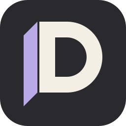
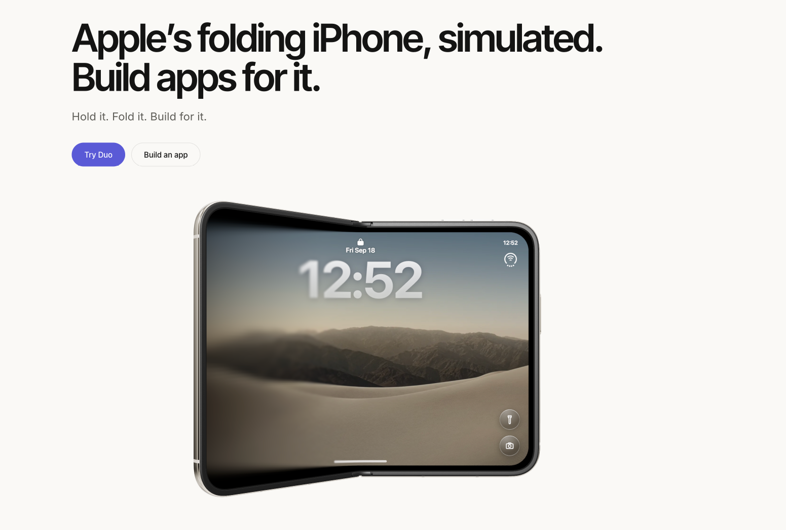

#  iPhone Duo

[Official website](https://duo.doan-labs.com/) · [Apps](https://duo.doan-labs.com/apps) · [Docs](https://duo.doan-labs.com/docs)

Built for the Astra challenge.

<a href="https://www.producthunt.com/products/duo-9?embed=true&amp;utm_source=badge-featured&amp;utm_medium=badge&amp;utm_campaign=badge-duo-536" target="_blank" rel="noopener noreferrer"></a>

A folding iPhone simulator for the browser and desktop. Explore the device, move between
its displays, and build apps that respond to the fold.

> An unofficial, experimental project by Doan Labs. Not an Apple product and not affiliated
> with Apple. iPhone is a trademark of Apple Inc.



## A device you can explore

Duo brings a Three.js device model together with an interactive home screen, apps,
gestures, and hardware controls. Fold it closed to use the cover display, open it for
more room, or place two apps side by side.

The same React and TypeScript shell runs on the web and in a native Tauri window.
An SDK, a shared UI kit, and a CLI provide a way to build and install independent apps
without rebuilding the simulator.


## See it in motion

https://github.com/user-attachments/assets/2460d57e-335e-4c2f-bda9-b00b6561417d

## Run locally

You'll need Bun and Python. For the desktop app, you'll also need Rust and the
Tauri prerequisites for your operating system.

Install dependencies and prepare Apple's model once:

```sh
bun install
pip install usd-core
python3 scripts/prepare-model.py
```

Start the web app:

```sh
bun run dev
```

Open [localhost:3000](http://localhost:3000). To run the desktop window instead, use
`bun run desktop`.

The model is downloaded into `public/model` and stays out of Git because it is not
redistributable. Native development currently focuses on macOS; Windows and Linux
parity has not been verified.

| Command | Purpose |
| --- | --- |
| `bun run dev` | Start the simulator in the browser |
| `bun run desktop` | Start the native Tauri window |
| `bun run typecheck` | Check the simulator and website types |
| `bun run build` | Build the web app into `dist/` |
| `bun run desktop:build` | Build the desktop app |

## Build an app

The website's `/build` pairs a browser-only AI chat with the simulator. Bring an
OpenRouter or browser-compatible API key; no local tools are needed to use it.
See the [browser builder guide](docs/platform/builder.md) for its boundaries.

Start with the [app development guide](docs/platform/dev.md), or explore the
[Fold Compass example](examples/fold-compass/README.md). The
[UI kit](packages/uikit/README.md) supplies shared components, while the
[SDK](packages/sdk/README.md) exposes the display and lifecycle APIs.

The developer packages are local previews. The [platform review guide](docs/platform/review.md)
walks through building, installing, and verifying an external app, with the current
testing scope and limitations.

## Find your way around

| Guide | What it covers |
| --- | --- |
| [Design rules](DESIGN.md) | The hard rules every visual change follows |
| [Documentation index](docs/README.md) | All project and platform guides |
| [Architecture](docs/architecture.md) | The scene, displays, shell, and native boundaries |
| [Working guide](docs/working.md) | Commands, controls, and contributor conventions |
| [Debugging](docs/debug.md) | Browser and native verification |
| [Developer platform](docs/platform/README.md) | App authoring, isolation, storage, and lifecycle |
| [Credits](docs/credits.md) | Third-party media in the simulator and its licences |

<details>
<summary>Repository layout</summary>

```
packages/
  shell/            scene, HUD, hardware buttons, shaders, native.ts, index.html
    springboard/    display layers, scenes, gestures and device controls
    apps.ts         remaining baked apps and home grid
    runtime/        isolated app bridge, device events, storage, lifecycle, catalog and registry
    desktop/        Tauri crate, commands/ and platform/
  uikit/            harvested typed components, tokens, icons and shared helpers
  sdk/              host types, sandbox contract/client and async React adapter
  cli/              create/check/build/dev/preview/serve, import and type validation
  web/              launch site and developer docs: TanStack Start, prerendered to dist/client
    src/routes/     one file per page, TanStack file routes
    src/builder/    provider chat, browser compiler, projects and live preview client
    src/home/       the launch page, one section per file, plus parts.tsx (blocks, headlines, code)
    src/kit/        the /kit hero and showcase grid: scenes/ holds one small live app per tile
    src/kit-demos/  one live demo per UI kit component, rendered and shown as source on /kit/docs/<name>
    src/            nav, footer, layout, markdown renderer, docs loader, kit preview, tokens, theme, reset.css
    src/hardware/   the /sdk page: a live wire of every payload up top, each device event beside one live phone, drawn as keys, viewfinder, dial, tiles, the tour that rings each cap, and a closing board of what the page heard
    src/simulator.tsx  the real shell in a frame, driven over the postMessage bridge, and told its device events
    src/live-code.tsx  a code sample whose running line lights up, and its readout
    src/segmented.tsx  the sliding-thumb group button, shared by every filter and tab strip
    src/side-nav.tsx  the docs sidebar: sliding hover and active indicators, a disclosure when narrow
    src/motion.ts   the shared easing curve, springs and press scale
    src/smooth-scroll.tsx  Lenis on the window, off under reduced motion
    scripts/        API generation, simulator/catalog copy, browser compiler assets and website checks
    vite-stylex.ts  StyleX for Vite, same Babel plugin as the root
  apps/             one private workspace per existing app
community-apps/     submitted apps for the curated catalog, one independent project per folder
  registry.json     maintainer-controlled id → folder and maintainers; reserved namespaces
  fold-compass/     the example submission: manifest, source, icon, screenshots, docs, license
public/             static assets; icons/ and gitignored model/
  readme/           README hero image and compressed demo video
examples/
  fold-compass/     independent public-SDK demo, never seeded into the shell
  developer/        installable public UI-kit component gallery
serve.ts            root development server
build.ts            root production build, writes dist/ and stylex.css
stylex-plugin.ts    shared Bun StyleX compilation
bunfig.toml         development plugin registration
tsconfig.json       shared strict TypeScript configuration
.cargo/             shared Rust cache configuration and shell-check alias
DESIGN.md           hard design rules for every visual change
docs/               maintainer guides and documentation index
  platform/         current platform references, roadmap, publication/website plans
    api/            generated UI-kit API data
scripts/            model preparation, asset extraction, screenshots
  build-app.ts      isolated document builder and local release catalog
  build-preinstalled.ts  bundled Notes and Weather releases
  package-platform.ts  private SDK/kit/CLI archives for external consumers
  check-platform.ts    local/CI platform gate
  check-submissions.ts community-apps gate: identity, completeness, dependencies, build
  publish-catalog.ts   merges validated releases into the catalog tree and rewrites its index
  check-app-tokens.ts   app appearance token gate alongside Biome
  generate-kit-docs.ts  exported props and TSDoc to API data
  checks/stage2/    native shell instrumentation and the Notes store fixture
  checks/stage4/    source validation and external package consumption checks
  checks/submission/ the invalid-submission cases
  checks/publish/   publisher behaviors on a scratch catalog tree
.github/
  workflows/        platform.yml validation; submissions.yml PR checks; publish.yml catalog publication
  CODEOWNERS        maintainer review for trust lists, scripts and workflows
  PULL_REQUEST_TEMPLATE/ app-submission.md
CONTRIBUTING.md     how to submit an app
design/             Blender sources, outside the build
.cache/             local verification evidence and Rust build output
```

</details>
